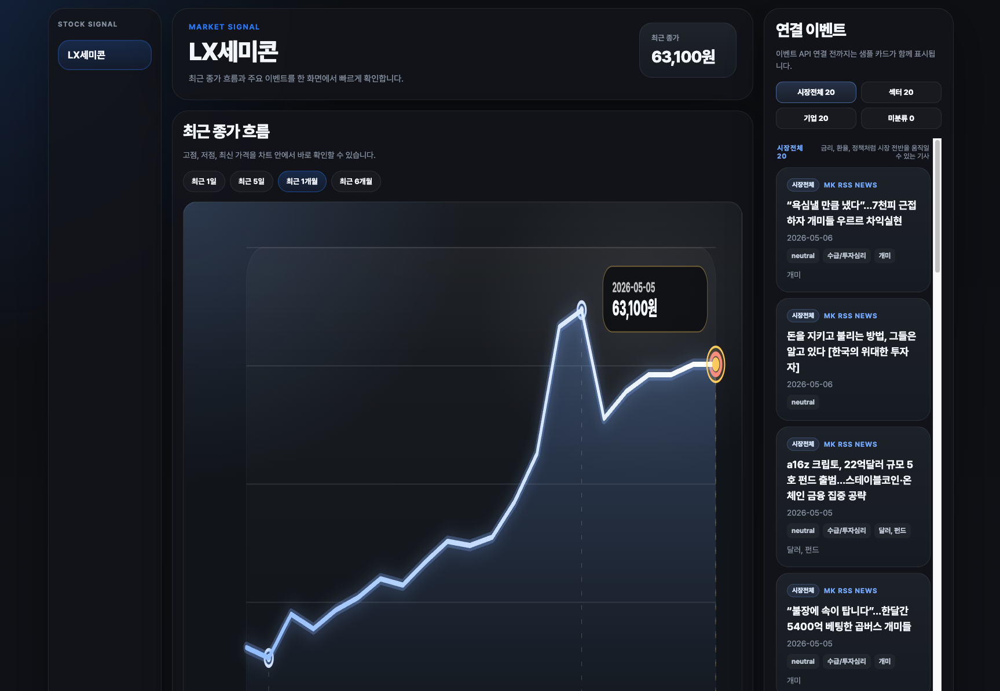

# Stock Signal Pipeline

주가 데이터와 경제 뉴스 이벤트를 함께 수집, 정제, 적재하고 웹 화면에서 확인하는 데이터 엔지니어링 포트폴리오 프로젝트입니다.

이 프로젝트의 목적은 단순히 API 데이터를 가져오는 것이 아니라, 원천별 수집 주기와 장애 복구 특성을 반영해 `raw -> bronze -> silver -> mart -> serving` 흐름을 설계하고, DuckDB 기반 mart의 동시 쓰기 문제를 Airflow orchestration 관점에서 제어하는 것입니다.


## 핵심 요약

- `Apache Airflow`로 KIS 주가, MK RSS 뉴스, OpenDART 공시 수집 구조를 구성했습니다.
- KIS 현재가와 MK RSS 수집 DAG는 raw/bronze/silver와 품질 체크 결과, silver 생성 manifest를 남깁니다.
- `load_silver_to_mart` DAG는 manifest를 읽어 아직 적재되지 않은 KIS 현재가와 MK RSS silver 파일만 DuckDB mart에 반영합니다.
- KIS 일봉 이력 DAG는 날짜별 backfill을 위해 logical date 기준으로 수집하고 silver 생성 후 mart까지 적재합니다.
- DuckDB write lock 문제를 Airflow pool, OS file lock, transaction 조합으로 제어했습니다.
- `check_pipeline_health` DAG는 최근 품질 체크 실패와 pending silver backlog를 점검하고 실패 시 Google Chat 알림 콜백을 사용합니다.
- MK RSS 뉴스 제목은 CSV 기반 knowledge graph와 규칙을 사용해 시장 전체, 섹터, 기업 이벤트로 분류합니다.
- FastAPI 웹 앱은 DuckDB serving view를 read-only로 읽어 가격 타임라인과 연결 이벤트를 제공합니다.

## 기술 스택

| 영역          | 사용 기술                                                              |
| ------------- | ---------------------------------------------------------------------- |
| Orchestration | Apache Airflow 3.1.8, DAG, task dependency, dynamic task mapping, pool |
| Processing    | Python, pandas, pyarrow/parquet                                        |
| Storage       | Local S3-style directory, JSON, Parquet, DuckDB                        |
| Quality/Ops   | 품질 체크 결과 파일, pending silver backlog 점검, Google Chat 알림     |
| Serving       | DuckDB serving view, FastAPI                                           |
| UI            | HTML, CSS, JavaScript                                                  |
| Runtime       | Docker Compose, Airflow metadata Postgres                              |

### 레이어 역할

| 레이어     | 역할                                                  |
| ---------- | ----------------------------------------------------- |
| Raw/Bronze | 외부 API/RSS 응답을 가능한 원형 그대로 JSON으로 저장  |
| Silver     | 분석 가능한 parquet 스키마로 정제                     |
| Manifest   | 이번 수집 run에서 생성된 silver 파일 목록 기록        |
| Mart       | 가격, 이벤트, 분류 결과를 DuckDB 테이블로 적재        |
| Serving    | 웹/API 조회를 위한 DuckDB view 제공                   |
| Ops        | 품질 체크 결과와 mart 적재 상태를 파일/테이블로 관리  |

## 주요 DAG

| DAG                                         | 주기                       | 역할                                                  |
| ------------------------------------------- | -------------------------- | ----------------------------------------------------- |
| `collect_kis_stock_price_raw`               | 평일 09:00-15:30, 1분 단위 | KIS 현재가 snapshot 수집, raw/bronze/silver 생성      |
| `collect_kis_stock_price_daily_history_raw` | 평일 19:00, catchup 가능   | KIS 일봉 이력 수집, silver 생성, mart 적재            |
| `collect_mk_rss_raw`                        | 10분 단위                  | MK RSS snapshot 수집, 기사 단위 silver 생성           |
| `load_silver_to_mart`                       | 1분 단위                   | manifest 기준 미적재 silver 파일을 DuckDB mart에 적재 |
| `check_pipeline_health`                     | 1시간 단위                 | 품질 체크 실패와 pending silver backlog 점검          |
| `recover_silver_to_mart`                    | 수동 실행                  | 지정 기간의 미적재 silver 파일 복구                   |
| `reproduce_duckdb_write_lock`               | 수동 실행                  | DuckDB 동시 쓰기 lock 문제 재현                       |
| `collect_opendart_raw`                      | 현재 비활성화              | OpenDART page manifest 기반 수집 구조                 |

## 데이터 흐름

```text
KIS current price / MK RSS DAG
  -> raw payload
  -> raw quality check
  -> bronze JSON
  -> bronze quality check
  -> silver parquet
  -> silver quality check
  -> silver_created_manifest

load_silver_to_mart DAG
  -> manifest scan
  -> not loaded silver filtering
  -> DuckDB mart insert
  -> mart validation
  -> loaded marker insert

FastAPI web app
  -> DuckDB serving view
  -> /api/stock-prices, /api/stock-events
  -> static web UI
```

## 설계 포인트

### 1. 수집 DAG와 mart 적재 DAG 분리

KIS 현재가와 MK RSS처럼 주기적으로 들어오는 원천은 수집 DAG의 책임을 silver 파일 생성까지로 제한하고, mart 반영은 `load_silver_to_mart` DAG가 전담합니다. 이렇게 하면 source별 DAG가 같은 `.duckdb` 파일에 동시에 접근하는 상황을 줄일 수 있습니다.

KIS 일봉 이력은 일자 단위 backfill 대상이므로 `collect_kis_stock_price_daily_history_raw` DAG 안에서 수집, bronze, silver, mart 적재를 순차 처리합니다.

### 2. 파일 단위 idempotency

`ops.mart_loaded_silver_file` 테이블에 이미 적재한 silver path를 기록합니다. DAG 재시도나 재실행이 발생해도 이 테이블을 기준으로 중복 적재를 피합니다.

### 3. DuckDB 동시 쓰기 제어

DuckDB는 embedded DB라 하나의 DB 파일에 여러 프로세스가 동시에 write connection을 열 수 없습니다. Airflow LocalExecutor 환경에서는 task가 서로 다른 Python 프로세스에서 실행될 수 있으므로 다음 보호 장치를 함께 사용했습니다.

- Airflow pool `duckdb_mart_writer` slot 1개로 scheduler 수준 직렬화
- OS file lock으로 DuckDB connection 생성 전 write critical section 보호
- 파일 단위 transaction으로 mart insert와 loaded marker insert를 원자적으로 처리

### 4. source별 수집 전략 분리

KIS 현재가는 장중 1분 snapshot, MK RSS는 10분 polling, KIS 일봉 이력은 날짜 단위 backfill 대상으로 다룹니다. 원천의 생성 주기와 복구 가능성이 다르기 때문에 DAG schedule, `catchup`, `execution_timeout`, `max_active_runs`를 source별로 다르게 설정했습니다.

### 5. 품질 체크와 운영 점검

수집 DAG는 raw, bronze, silver 단계별 품질 체크 결과를 `airflow/s3/ops/quality_check_result` 아래에 저장합니다. `check_pipeline_health` DAG는 최근 품질 체크 실패와 60분 이상 쌓인 pending silver backlog를 감지하면 실패 처리하고 Google Chat 알림 콜백을 사용합니다.

### 6. 결정적 뉴스 이벤트 분류

MK RSS 제목은 외부 AI 호출 없이 CSV 기반 knowledge graph와 규칙으로 분류합니다.

- `impact_scope`: 시장전체, 섹터, 기업
- `driver_category`: 이벤트를 움직인 주요 요인
- `impact_direction`: positive, negative, mixed, neutral
- `*_evidence`: 분류 근거로 사용한 키워드와 엔티티

이 방식은 같은 입력에 같은 결과를 반환하므로 비용, 재현성, 검증 가능성 측면에서 MVP 데이터 파이프라인에 적합합니다.

## 웹 화면

FastAPI 앱은 `../airflow/s3/mart/stock_signal.duckdb`를 read-only로 조회합니다. 가격 API는 `serving.v_stock_price_daily`, `serving.v_stock_price_timeline`이 있으면 우선 사용하고, 없으면 mart 테이블을 fallback으로 조회합니다.



제공 API:

- `GET /api/stock-prices`
- `GET /api/stock-events`
- `GET /health`

## 로컬 실행

### 1. Airflow 실행

```bash
cd airflow
cp .env.example .env
docker compose up -d
```

Airflow UI:

```text
http://localhost:8080
```

KIS 수집을 실행하려면 `airflow/.env`에 KIS Open API 인증 정보가 필요합니다.

```text
KIS_OPEN_API_APP_KEY=...
KIS_OPEN_API_APP_SECRET=...
```

Airflow 초기화 컨테이너는 `duckdb_mart_writer` pool을 생성하고, `.env`의 `STOCK_SIGNAL_*` 값을 Airflow Variable로 주입합니다. 현재 코드의 기본 수집 대상 종목은 `LX세미콘(108320)`입니다.

### 2. 웹 앱 실행

```bash
cd web
cp .env.example .env
docker compose up -d
```

웹 UI:

```text
http://localhost:8000
```

웹 앱은 `WEB_DUCKDB_PATH=/data/mart/stock_signal.duckdb`를 read-only로 조회합니다. mart 파일이 아직 없거나 serving view가 없으면 빈 데이터 또는 UI fallback 데이터가 표시될 수 있습니다.

## 프로젝트 구조

```text
.
├── airflow
│   ├── dags                 # Airflow DAG 정의
│   ├── plugins              # 수집, 변환, 품질 체크, mart 적재 로직
│   ├── s3                   # 로컬 S3-style 데이터 레이크와 DuckDB mart
│   ├── logs                 # Airflow task 로그
│   └── docker-compose.yaml
├── docs
│   ├── data-engineering-lifecycle
│   ├── data-modeling
│   ├── reference
│   └── image
├── knowledge graph          # MK RSS 분류용 KG 산출물 작업 영역
├── web
│   ├── app.py               # FastAPI API 서버
│   ├── static               # 웹 UI
│   └── docker-compose.yaml
├── DuckDB 문제 해결 과정 계획.md
└── 운영 가능한 파이프라인 계획.md
```

## 주요 엔지니어링 문제 해결

- 원천별 데이터 생성 주기가 달라지는 문제를 해결하기 위해 KIS 현재가, KIS 일봉, MK RSS, OpenDART의 DAG schedule, catchup, skip 조건을 각각 다르게 설계했습니다.
- 외부 API/RSS 수집 실패가 전체 파이프라인 장애로 번지지 않도록 task 단위 retry, retry delay, execution timeout을 적용했습니다.
- 수집과 mart 적재가 강하게 결합되는 문제를 줄이기 위해 raw/bronze/silver/mart 레이어를 분리하고, silver_created_manifest로 파일 단위 lineage를 남겼습니다.
- DuckDB embedded DB의 동시 쓰기 lock 문제를 재현한 뒤 Airflow pool, OS file lock, transaction을 조합해 mart write 경로를 직렬화했습니다.
- DAG 재시도와 재실행 때 중복 적재가 발생하지 않도록 ops.mart_loaded_silver_file 테이블을 기준으로 파일 단위 idempotency를 구현했습니다.
- 짧은 장애와 긴 장애를 나눠 복구할 수 있도록 자동 lookback 적재, hourly health check, 수동 recovery DAG를 함께 설계했습니다.
- 비정형 뉴스 제목을 서비스에 바로 노출하지 않고 knowledge graph와 규칙 기반 evidence로 시장전체, 섹터, 기업 이벤트로 표준화했습니다.
- DuckDB serving view와 FastAPI를 연결해 파이프라인 산출물을 웹 화면에서 검증할 수 있게 구성했습니다.

## 현재 한계와 다음 개선 후보

- KIS 현재가 수집 대상 종목이 코드 상수로 고정되어 있어 다종목 확장이 필요합니다.
- OpenDART DAG는 구조만 남아 있고 현재 수집 task가 비활성화되어 있습니다.
- Google Chat 알림은 실패 콜백 중심이며, 별도 metric 저장소나 SLA 대시보드는 아직 없습니다.
- 로컬 S3-style 디렉터리를 사용하고 있어 실제 AWS S3 배포 시 credentials, object store I/O, 권한 정책 검증이 필요합니다.
- KG 기반 분류는 결정적이지만, 분류 품질을 검증하는 테스트 데이터셋과 평가 지표가 아직 부족합니다.

## 관련 문서

- [오케스트레이션 주요 엔지니어링](docs/data-engineering-lifecycle/오케스트레이션%20주요%20엔지니어링.md)
- [데이터 수집 주요 엔지니어링](docs/data-engineering-lifecycle/데이터%20수집%20주요%20엔지니어링.md)
- [데이터 변환 엔지니어링](docs/data-engineering-lifecycle/데이터%20변환%20엔지니어링%28해석%20가능한%20형태로%20변환하기%29.md)
- [DuckDB 동시 쓰기 문제 해결 과정](docs/data-engineering-lifecycle/DuckDB%20동시%20쓰기%20문제%20해결%20과정.md)
