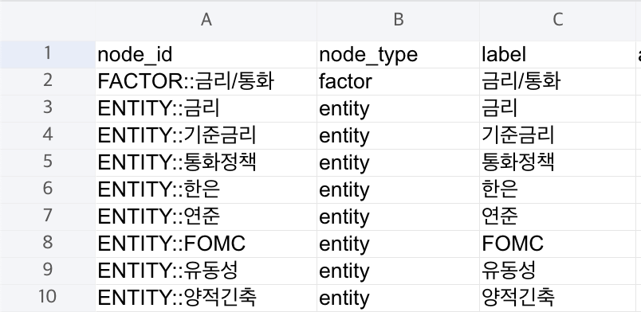
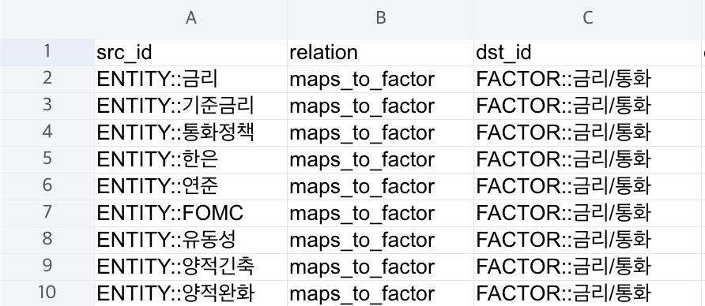

# 데이터를 해석 가능한 형태로 변환하기

> 이 프로젝트는 특정 종목의 주가와 주요 경제 뉴스를 한 화면에 함께 보여줘서, 사용자가 가격 변화와 경제 흐름을 이해하도록 돕는 서비스다.

이 문서는 그중 “어떤 뉴스 기사를 주요 이벤트로 보여줄 것인가” 라는 비즈니스 문제를 데이터 엔지니어링 관점에서 어떻게 풀었는지 정리한 문서다.

>

---

# 1. 문제 정의

## 1.1 문제 상황

서비스는 `매일경제 RSS`, `OpenDART` 등에서 경제 뉴스와 공시 데이터를 수집하고 있다.

하지만 수집된 원천 데이터를 그대로 서비스에 노출하는 것은 적절하지 않다.

경제 뉴스와 공시는 양이 많고 성격도 다양한데 이를 모두 보여주면 특정 종목과 직접 관련 없는 정보까지 함께 노출되어, 사용자가 가격 변화의 핵심 흐름을 읽기 어려워진다.

반대로 너무 적은 이벤트만 보여주면 시장 맥락이 과도하게 축약되어, 가격 변화를 지나치게 단순한 흐름으로 오해할 수 있다.

즉, 이 서비스의 핵심 문제는 데이터를 수집하는 것 자체가 아니라, 수집된 이벤트 중 무엇을 서비스상 “주요 이벤트”로 보여줄지 결정하는 것이다.

## 1.2 데이터 엔지니어의 책임 바탕에서 생각

> 데이터 엔지니어는 원천 시스템에서 데이터를 가져와서 사용 사례에 데이터를 제공하는 데이터 엔지니어링 수명 주기를 관리한다. - ⌜견고한 데이터 엔지니어링⌟

이 관점에서 보면, 이 문제에서 데이터 엔지니어가 해야 할 일은 다음과 같다.

- 뉴스·공시 원문을 그대로 노출하지 않기
- 주가와 이벤트 사이의 관련도 판단 기준을 데이터 구조와 파이프라인으로 명시하기
- downstream이 같은 기준을 재사용할 수 있는 공통 후보 레이어를 만들기
- 사용자가 왜 연결되었는지 이해할 수 있도록 근거가 남는 구조를 만들기

## 1.3 최종 문제 정의

따라서 이 문제는 다음과 같이 정의했다.

원시 뉴스·공시 이벤트를, 주가와의 관련성을 기준으로 해석 가능한 후보 이벤트 데이터를 제공하는 것

---

# 2. 문제의 원인

## 2.1 원천 데이터의 비정형성

뉴스 데이터는 제목과 본문이 자연어 중심의 비정형 데이터다.

같은 의미도 표현 방식이 다양하고, 종목명·산업·거시 이벤트가 서로 다른 단위로 섞여 있다. 공시 데이터도 구조화된 필드만으로는 충분하지 않으며, 실제 의미 해석에는 텍스트 문맥이 필요하다.

즉, 원천 이벤트 데이터는 수집은 가능하지만, 서비스에 바로 사용할 만큼 의미가 정리되어 있지 않다.

## 2.2 종목 관련성 판단 기준의 부재

원천 데이터에는 “이 이벤트가 어떤 종목과 얼마나 관련 있는가”를 판단할 기준이 없다.

같은 기사라도 다음이 섞여 있을 수 있다.

- 시장 전체 이슈
- 산업·테마 이슈
- 개별 기업 이슈

이 구분이 없으면 주가와 이벤트를 연결할 때 과잉 연결이나 오연결이 발생한다.

## 2.3 단순 조회·키워드 매칭으로 해결되지 않음

이 문제는 단순 조회나 종목명 키워드 매칭만으로 해결되지 않는다.

- 종목명이 기사에 직접 나오지 않을 수 있음
- 같은 대상을 여러 표현으로 지칭할 수 있음
- 기사 시각과 가격 시각이 다를 수 있음
- 관련성이 곧 인과를 의미하지는 않음

즉, 문제의 원인은 원천 데이터의 비정형성, 종목 관련성 기준의 부재, 그리고 단순 문자열 매칭만으로는 해석 가능한 연결을 만들기 어렵다는 점이다.

---

# 3. 해결 과정

## 3.1 AI 분류를 사용하지 않기로 결정

처음에는 뉴스 제목을 AI가 직접 분류하는 방안도 검토했지만 MVP에서는 이를 주요 분류 엔진으로 채택하지 않았다.

1. 비용: RSS와 공시 데이터는 누적량이 빠르게 커지므로, 제목 단위 AI 분류를 지속하면 운영비가 발생한다.
2. 비결정성: 같은 입력에도 결과가 달라질 수 있어, 데이터 파이프라인에 필요한 재현성·검증 가능성·회귀 테스트 안정성과 충돌한다.

따라서 AI는 보조 수단으로는 가능하지만, 기준 분류 엔진으로는 적합하지 않다고 판단했다.

## 3.2 문자열이 아니라 의미 단위로 해석하기로 함

이 문제를 설계할 때 참고한 사례는 [DoorDash의 검색 관련성 개선 방식](https://careersatdoordash.com/blog/understanding-search-intent-with-better-recall/)이다.

기존 검색 방식은 질의를 토큰 단위로 나누고, 문자열 유사도를 중심으로 매칭하는 구조였다. 그러나 데이터 규모와 복잡성이 커지면서 이 방식의 한계가 드러났다. 같은 의미의 질의라도 단어 형태가 조금만 달라지면 제대로 연결하지 못했고, 질의를 개념이 아닌 단어 묶음(Bag of Words)으로 처리한 것이 근본 원인이었다. 예를 들어 `salsa`와 `salsas`처럼 의미가 거의 같은 질의도 검색 결과가 달라졌고, 카테고리 검색 성능 역시 충분히 좋지 못했다.

이를 개선하기 위해 DoorDash는 질의 이해 단계를 다음과 같이 구성했다.

- 표준화: 오탈자, 노이즈, 동의어를 정리해 질의를 정규형으로 변환
- 개념 식별 및 엔티티 링크: 입력된 단어가 실제 어떤 개념과 대상을 가리키는지 연결
- 의도 확장: 지식 그래프를 기반으로 유사 개념과 관련 대상을 확장

이 중에서 특히 개념 식별 및 엔티티 링크 단계는, 현재 프로젝트의 문제 상황에도 적용할 수 있는 접근이라고 판단했다.

DoorDash는 질의를 문자열 그대로 보지 않고, 직접 구축한 지식 그래프를 활용해 그것이 가리키는 개체(entity) 와 관계(relation) 로 해석함으로써 검색 관련성을 높였다.

이 프로젝트도 구조적으로 유사하다.

- DoorDash의 문제: 검색어와 결과의 관련성 판단
- 이 프로젝트의 문제: 뉴스와 시장 영향의 관련성 판단

즉, 이 프로젝트 역시 뉴스 제목 문자열을 그대로 다루는 것이 아니라, 그 안에서 어떤 개념이 등장했는지, 무엇을 가리키는지, 시장 전체·섹터·기업 중 어느 범위의 이벤트인지를 해석해야 하는 문제였다.

## 3.3 지식 그래프(KG) 기반 구조 채택

선택한 구현 방식은 경제 뉴스용 지식 그래프(KG)다. 다만 MVP에서는 그래프 DB를 바로 도입하지 않고, CSV 기반 KG로 시작했다.

이렇게 결정한 이유는 다음과 같다.

- 구조가 단순해 빠르게 구현 가능
- 사람이 직접 열어보고 검증하기 쉬움
- pandas/파이썬으로 처리 가능
- 이후 Postgres나 그래프 DB로 확장하기 쉬움

저장 구조는 두 파일로 나눴다.

- `mk_kg_nodes.csv`
- `mk_kg_edges.csv`

## 3.4 KG 모델 설계

그래프의 중심은 `article` 노드이므로 각 기사에서 파생되는 의미 요소를 관계로 연결하도록 설계했다.

이 구조의 핵심은 값을 평평하게 저장하는 것이 아니라, 기사와 개념 사이의 관계를 저장한다는 점이다.

즉, 뉴스 제목을 문자열 데이터가 아니라, 해석 가능한 개념 관계 구조로 변환했다.

## 3.5 KG 구축 절차

1️⃣ 기사 수집

- 매일경제 일별 sitemap에서 경제 기사 URL 수집
- 기사 HTML에서 제목과 발행 시각 추출

2️⃣ 제목 정규화

- HTML 엔티티 제거
- 불필요한 공백 제거
- 매체 꼬리 문구 등 불필요 표현 제거

3️⃣ 분류용 지식 사전 적용

사전에 정의한 alias 사전과 규칙을 적용했다.

예시: `금리`, `연준`, `기준금리` → `금리/통화`, `환율`, `달러`, `수출` → `환율/무역`

즉, AI가 학습해서 분류하는 방식이 아니라, 사람이 정의한 지식 사전 + 규칙으로 해석했다.

4️⃣ 기사별 관계 생성

제목 정규화 뒤 alias 매칭과 규칙 기반 로직으로 범위·원인·방향을 계산하고, 사용된 매칭 근거를 evidence로 남겼다.

5️⃣ KG 저장

- 기사, 요인, 섹터, 엔티티, 범위, 방향을 노드로 저장
- 이들 사이의 관계를 엣지로 저장

- `mk_kg_nodes.csv`
  
- `mk_kg_edges.csv`
  

## 3.6 KG를 분류용 lookup table로 사용

### 동작 순서

1. RSS 또는 공시 제목 1건 입력
2. 제목 정규화
3. KG CSV에서 `alias → factor`, `alias → sector` 매핑 복원
4. 제목 내 alias 매칭 탐지
5. 매칭 결과를 바탕으로 범위·원인·방향 계산
6. 근거와 함께 최종 분류 결과 반환

### 최종 분류 결과 스키마

- `impact_scope`: `시장전체` / `섹터` / `기업`
- `driver_category`
- `impact_direction`: `positive` / `negative` / `mixed` / `neutral`
- `scope_evidence`
- `driver_evidence`
- `direction_evidence`
- `matched_entities`

### 해석 규칙 예시

- 회사명 후보가 있으면 `기업`
- 거시 키워드가 있으면 `시장전체`
- 섹터 키워드가 있으면 `섹터`
- 긍정·부정 단어 사전과 정규식으로 방향 판단
- factor가 매칭되면 factor를 우선 driver로 채택
- factor 없이 sector만 있으면 `산업수요/공급망`으로 분류

## 3.7 정리

> 뉴스 제목을 그대로 노출하거나 단순 키워드 매칭하지 않고, 사전에 정의한 개념 체계와 규칙을 바탕으로 해석 가능한 후보 이벤트 데이터로 변환하는 구조를 만들었다.

# 4. 기대 효과, 한계, 의미

## 4.1 기대 효과

### 데이터 측면

- 동일 입력에 동일 출력이 나오는 결정적 분류 체계 확보
- 규칙 기반 분류 결과에 대한 검증 가능성 확보
- AI 호출 없이 운영 가능한 비용 통제 구조 확보

### 서비스 측면

- 사용자가 가격과 이벤트를 함께 해석할 수 있는 환경 제공
- 과도한 기사 노출로 인한 노이즈 감소
- 과도한 축약으로 인한 해석 왜곡 가능성 감소
- 분류 근거를 함께 제공해 결과 신뢰도 향상

## 4.2 현재 한계

- 규칙 사전에 없는 새로운 표현은 놓칠 수 있음
- 제목만 기준으로 판단하므로 본문 맥락까지 반영하지 못함
- 현재 구조는 정교한 랭킹보다 우선 분류와 후보 축소에 초점이 있음
- 기업명 판별이 완전한 엔티티 사전 수준까지는 도달하지 못함

## 4.3 다음 단계

- 현재 구조는 “주요 뉴스 선정”보다는 “제목 분류”에 가까우므로, 이후 후보 내 랭킹 단계가 추가로 필요함
- 추가 비즈니스 요구사항에 맞는 분류 체계 확장 및 파이프라인 수정이 필요함
- KG 조회 성능과 분류 처리 성능을 함께 최적화할 필요가 있음
- 필요 시 본문, 시간 정보, 시장 데이터까지 결합해 관련도 판단 정밀도를 높일 수 있음

## 4.4 의미

원천 데이터를 그대로 노출하지 않고, 해석 가능한 구조로 변환한 것

- 원천 데이터를 서비스와 분석이 재사용할 수 있는 구조로 가공했고
- 비즈니스 해석 규칙을 파이프라인에 구조화했으며
- 왜 그렇게 분류되었는지 설명할 수 있도록 근거를 남겼음
