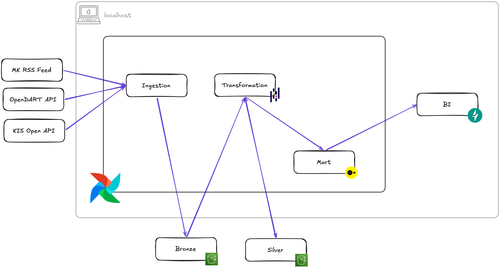

### 데이터 엔지니어링 수명주기

### 파이프라인 구성도

# 1. 데이터 생성 주요 엔지니어링

- [원천 시스템(데이터 생성) 엔지니어링](<../data-engineering-lifecycle/원천 시스템(데이터 생성) 엔지니어링.md>)

- `KIS(한국투자증권)`
  - 주가 타임라인 구축용 1분 단위 스냅샷 수집
- `MK(매일경제) RSS`
  - 뉴스 이벤트 후보 확보용 10분 polling 수집
  - 최근 50개 기사만 조회되는 롤링 윈도우
  - source 휘발성으로 인한 완전 복구 한계
- `OpenDART`
  - 기업 이벤트의 날짜 기준(일 1회) 수집

- [MK RSS raw dedup 의사결정](<../MK RSS raw dedup 의사결정.md>)

# 2. 데이터 수집 주요 엔지니어링

- [데이터 수집 주요 엔지니어링](<../data-engineering-lifecycle/데이터 수집 주요 엔지니어링.md>)
- pdf
- [원천 시스템별 raw 수집 구현 요약](<../data-engineering-lifecycle/원천 시스템별 raw 수집 구현 요약.md>)

# 3. 시연

- [Airflow 데이터 수집 Dag(KIS)](http://localhost:8080/dags/collect_kis_stock_price_raw/runs/scheduled__2026-04-20T06:59:00+00:00)
- 파일 시스템에 저장된 Bronze, Silver, Mart(/airflow/s3/)
- [web ui 화면](http://localhost:8000/)

# 4. 이후 과제

## 4.1 데이터 모델링

- Silver 표준 구조 정의
- 조회 요구사항 기준 Mart DDL 설계
- 원천별 데이터 특성을 반영한 grain·key·적재 기준 확정

## 4.2 데이터 저장 주요 엔지니어링

- 현재 로컬 파일시스템 기반으로 Bronze·Silver 저장 중
- 운영 안정성, 재처리, 확장성을 고려한 S3 도입 검토
- S3 도입 필요성과 기대효과를 비용 관점까지 포함해 문서화

## 4.3 데이터 변환 주요 엔지니어링

- 비즈니스 목표: 주가와 주요 경제 이벤트를 함께 제공해 사용자의 경제 흐름 이해 지원
- 과제: 어떤 이벤트를 “주요”로 볼 것인지에 대한 기준 정립 필요
- 과도한 이벤트 노출 시 화면 복잡도와 해석 난이도 증가
- 부정확한 선별 시 잘못된 흐름 해석을 유도할 위험 존재
- 따라서 이벤트 중요도 판단 기준을 데이터 기준으로 명시적으로 설계할 필요
- 단순 수집·적재를 넘어, 사용자 해석을 돕는 형태로 데이터 변환 필요
- 경제적 의미를 과도하게 임의 해석하지 않도록 변환 책임 범위 명확화
